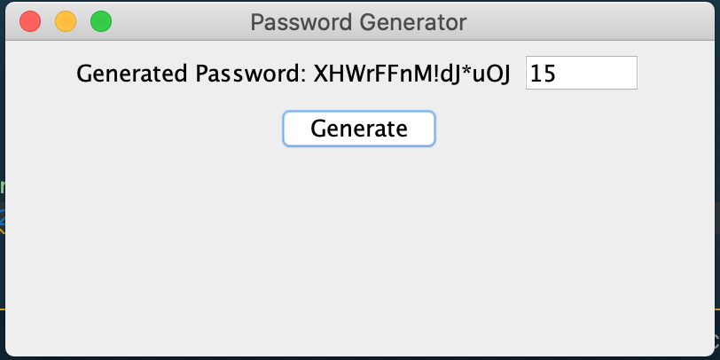
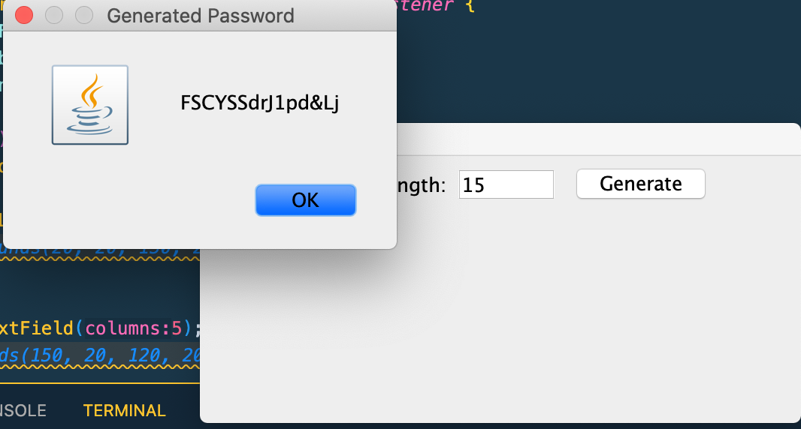

# PasswordGenerator
A Simple Password generator using Java.

I have two folders one is with JFrame and the other is with JFrame and Jpanel.
You can generate multiple time using JFrame one, and Jpanel is required to close the frame window.

## Output

Name: Java program to generate random password using JFrame

Name: Java program to generate random password using JFrame and Jpanel

